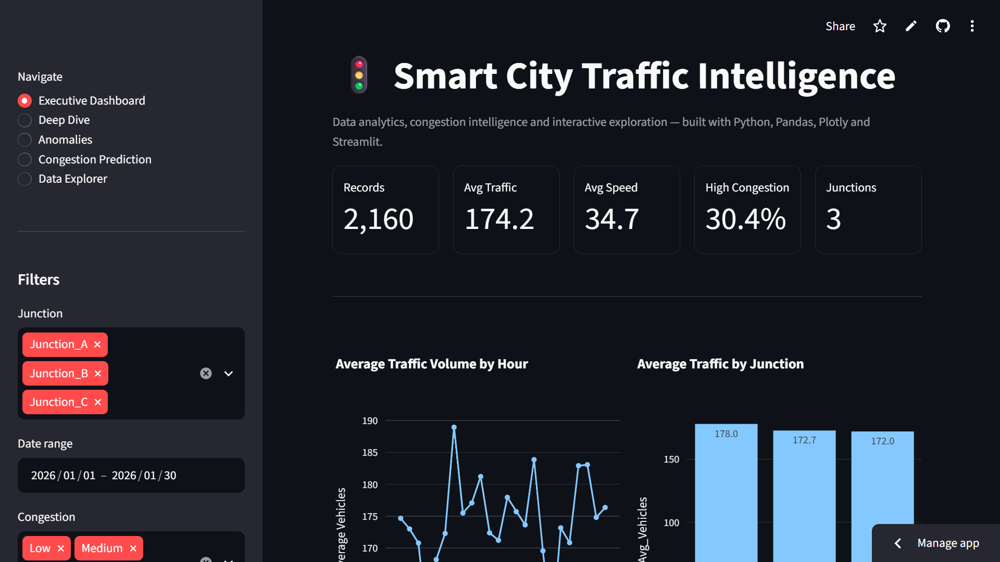
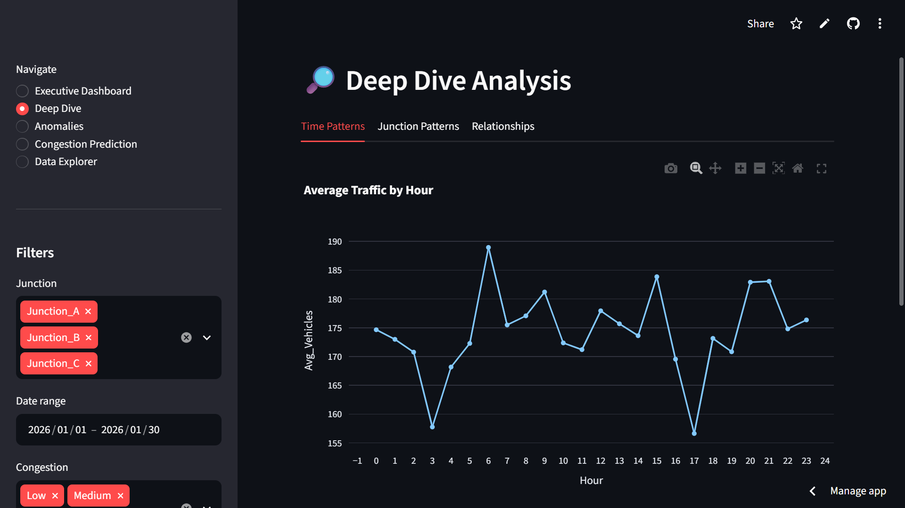
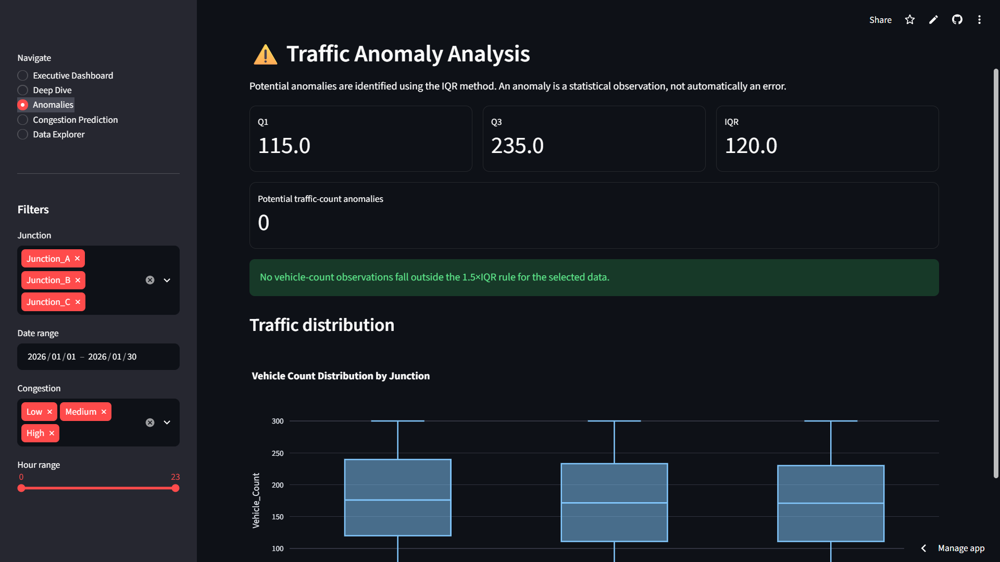
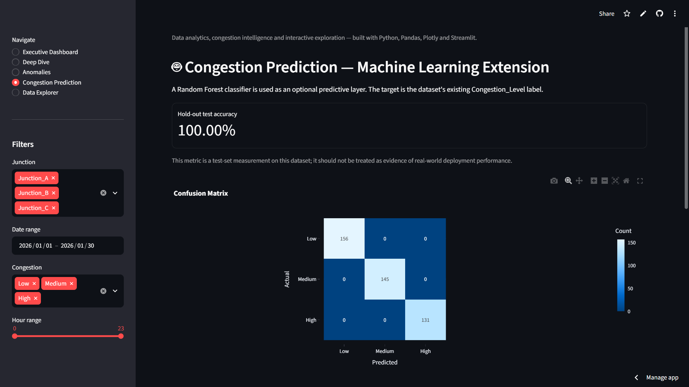
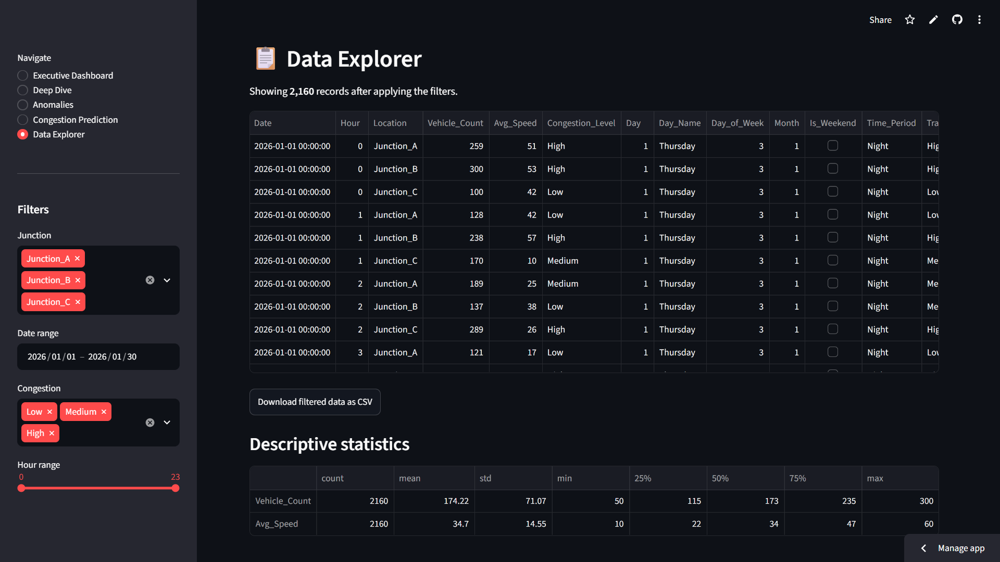

# 🚦 Smart City Traffic Intelligence

An end-to-end Traffic Analytics and Congestion Intelligence platform built using **Python, Pandas, Plotly, and Streamlit**. This project analyzes urban traffic patterns, identifies congestion hotspots, detects anomalies, and provides interactive visualizations for data-driven decision making.

---

## 🌐 Live Demo

🔗 **Launch Application**

https://smartcitytrafficintelligence-cbypjcwsd634apppz6gfcx3.streamlit.app

---

## 📌 Project Overview

Managing urban traffic efficiently is a critical challenge for modern smart cities. This project provides an interactive analytics dashboard that helps stakeholders:

- Monitor traffic conditions
- Analyze congestion patterns
- Identify anomalies
- Explore traffic trends
- Predict congestion levels
- Make informed transportation decisions

The application delivers insights through an intuitive web-based dashboard powered by Streamlit.

---

## ✨ Key Features

### 📊 Executive Dashboard
- Traffic KPIs and summary metrics
- Traffic volume monitoring
- Average speed insights
- High congestion indicators

### 🔍 Deep Dive Analysis
- Hourly traffic trends
- Junction-wise analysis
- Traffic distribution patterns
- Detailed exploratory analytics

### ⚠️ Anomaly Detection
- Identification of unusual traffic conditions
- Outlier visualization
- Traffic irregularity monitoring

### 🚗 Congestion Prediction
- Congestion trend exploration
- Predictive analytics
- Traffic intelligence insights

### 📂 Data Explorer
- Interactive dataset browsing
- Filtering and exploration capabilities
- Traffic data inspection

---

# 📸 Dashboard Screenshots

## Executive Dashboard

screenshots/Dashboard.png

---

## Deep Dive Analysis

screenshots/Deep_dive_analysis.png

---

## Anomaly Detection

screenshots/Traffic_Anomaly_analysis.png

---

## Congestion Prediction

screenshots/Congestion_Prediction.png

---

## Data Explorer

screenshots/Data_Explorer.png

---

## 🛠️ Technology Stack

### Programming Language
- Python

### Data Analytics
- Pandas
- NumPy

### Visualization
- Plotly

### Web Framework
- Streamlit

### Version Control
- Git
- GitHub

### Deployment
- Streamlit Community Cloud

---

## 📁 Project Structure

```text
smart_city_traffic_dashboard/
│
├── app.py
├── requirements.txt
├── README.md
│
├── data/
│   └── smart_city_traffic_cleaned.csv
│
├── screenshots/
│   ├── Dashboard.png
│   ├── Deep_dive_analysis.png
│   ├── Traffic_Anomaly_analysis.png
│   ├── Congestion_Prediction.png
│   └── Data_Explorer.png
│
├── DEPLOYMENT_GUIDE.md
├── INTERVIEW_NOTES.md
└── PROJECT_STRUCTURE.txt
```

---

## 🚀 Installation & Local Setup

Clone the repository:

```bash
git clone https://github.com/VamsiKrishna1318/Smartcity_traffic_intelligence.git
```

Navigate to the project directory:

```bash
cd Smartcity_traffic_intelligence
```

Install dependencies:

```bash
pip install -r requirements.txt
```

Run Streamlit:

```bash
streamlit run app.py
```

---

## 📈 Business Value

This solution can help:

- Smart City Administrations
- Traffic Control Centers
- Urban Planning Departments
- Transportation Authorities
- Data Analytics Teams

to better understand and optimize traffic movement across city road networks.

---

## 🎯 Skills Demonstrated

- Data Cleaning
- Exploratory Data Analysis (EDA)
- Data Visualization
- Dashboard Development
- Predictive Analytics
- Streamlit Development
- Git & GitHub
- Cloud Deployment

---

# 📸 Dashboard Screenshots

### 📊 Executive Dashboard



---

### 🔍 Deep Dive Analysis



---

### ⚠️ Anomaly Detection



---

### 🚗 Congestion Prediction



---

### 📂 Data Explorer



---

## 👨‍💻 Author

**Bendi Poorna Chandra Vamsikrishna**

GitHub: https://github.com/VamsiKrishna1318

---

⭐ If you found this project useful, consider giving the repository a star.
